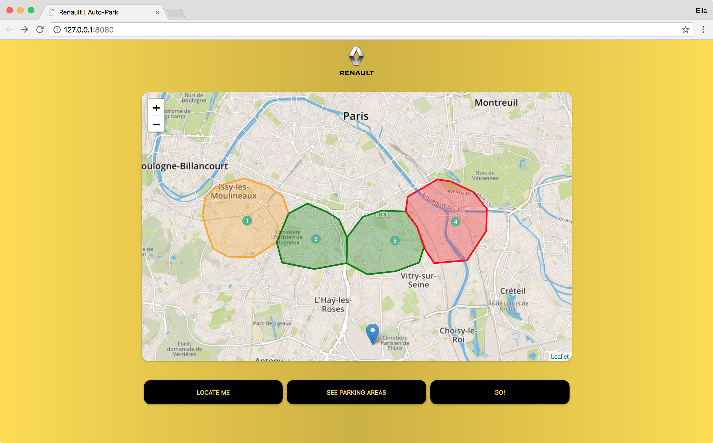

# auto-park-fe
VivaTech Hackathon Auto Park Frontend.

Take a look at the backend [here](https://github.com/eliamaino-fp/auto-park-be).

To get started go [here](#start).

## What is it?
This project is a prototype of a smart car application which selects the best route based on:
 * distance by car
 * distance by public transports
 * parking availability

## How it works

### First step
Locate yourself


### Second step
See the parking areas and the car dropout zones for your car


### Third step
Get the directions


### Last step
GO!


## Get Started<a name="start"></a>
Run the following commands to get the project up and running.

### Install dependencies
```
npm install
```

### Compile
```
webpack
```

### Run a local server
```
npm start
```

Go to `http://127.0.0.1:8080` !!
